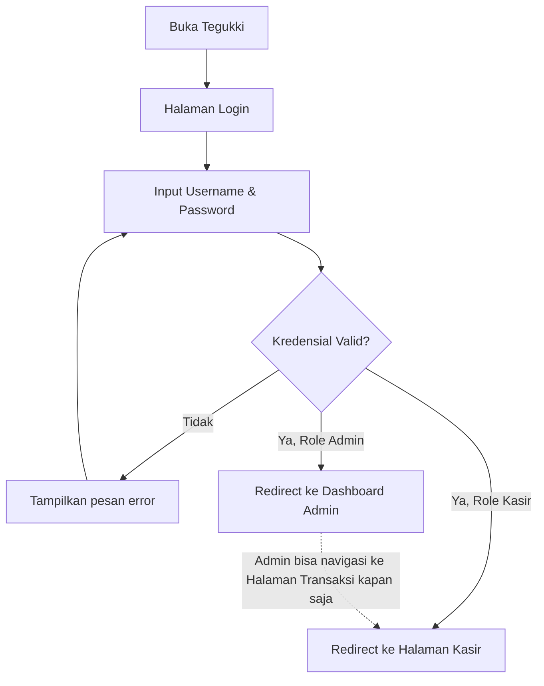
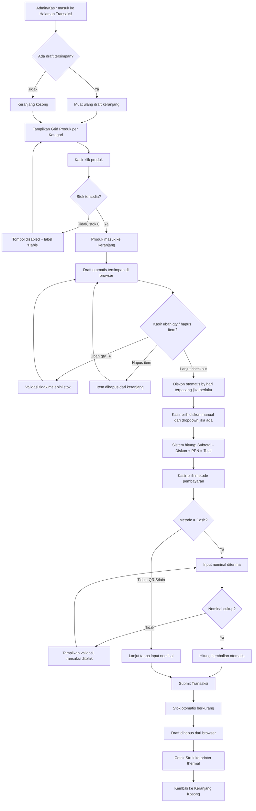
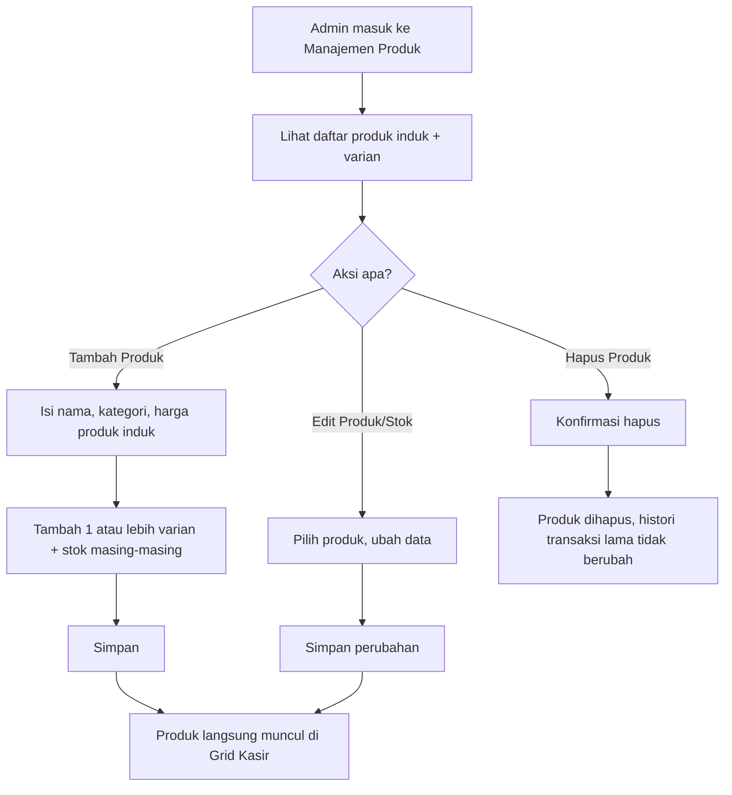
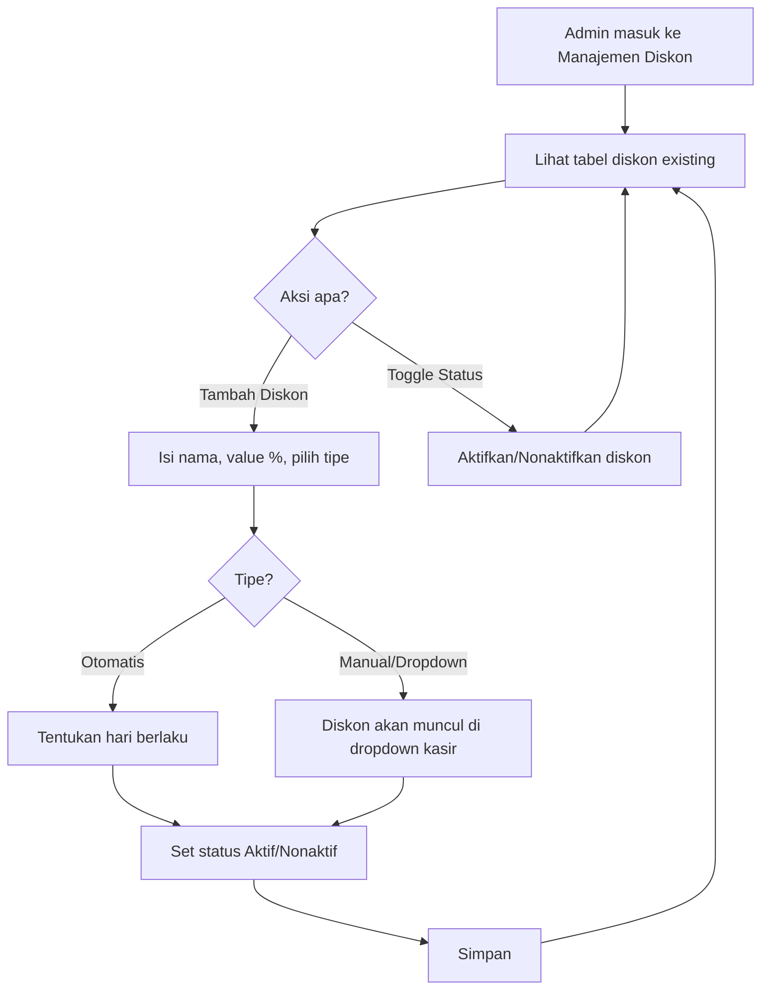
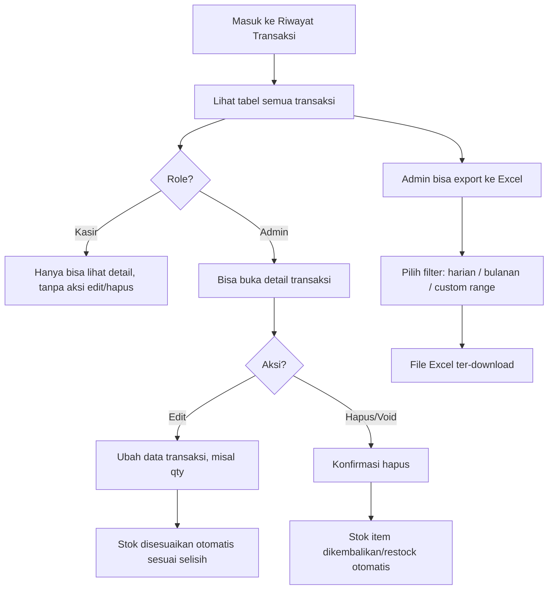
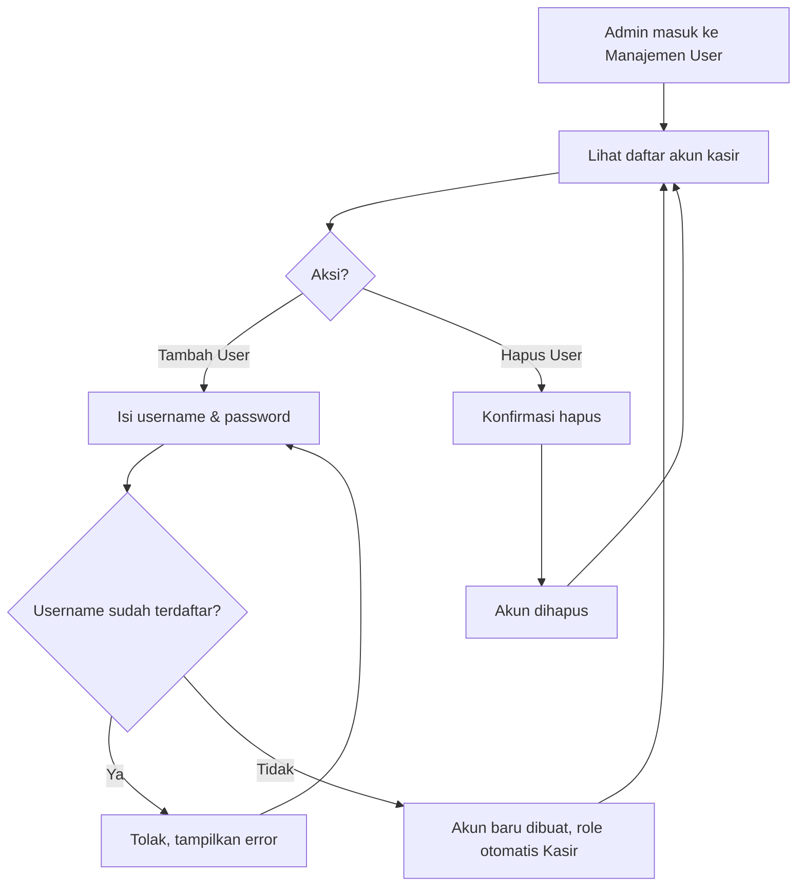

# 08 - User Flow

## 1. Overview

Dokumen ini menjabarkan alur pengguna utama untuk 2 role: **Admin (Owner)** dan **User (Kasir)**, berdasarkan fitur di `05-PRD.md`.

---

## 2. Flow: Login (Semua Role)

---

## 3. Flow: Transaksi Kasir (Happy Path & Edge Case)

> **Catatan**: Halaman Transaksi/Kasir bersifat **shared** — dapat diakses oleh Admin maupun User (Kasir). Admin biasanya berperan sebagai pengelola, tapi dapat masuk ke halaman ini untuk bertransaksi langsung (misal saat toko sepi pegawai). Alur di bawah berlaku sama untuk kedua role.

---

## 4. Flow: Manajemen Produk & Stok (Admin)

---

## 5. Flow: Manajemen Diskon (Admin)

---

## 6. Flow: Riwayat Transaksi & Void (Admin) / View (Kasir)

---

## 7. Flow: Manajemen User (Admin)

---

## 8. Ringkasan Titik Kritis (Edge Cases)

| Titik Kritis | Penanganan |
|---|---|
| Stok produk 0 saat kasir memilih | Tombol disabled + label "Habis", tidak bisa diklik |
| Koneksi terputus saat transaksi berjalan | Draft tersimpan lokal di browser, otomatis dimuat ulang saat kembali ke halaman |
| Nominal cash kurang dari total | Transaksi ditolak, validasi ditampilkan, kasir harus input ulang |
| Dua kasir transaksi produk stok terbatas bersamaan | Validasi stok di backend saat submit — transaksi kedua ditolak jika stok sudah habis |
| Admin void transaksi | Stok otomatis dikembalikan (restock) |
| Admin hapus produk yang ada di histori transaksi lama | Histori transaksi tidak berubah/rusak |
