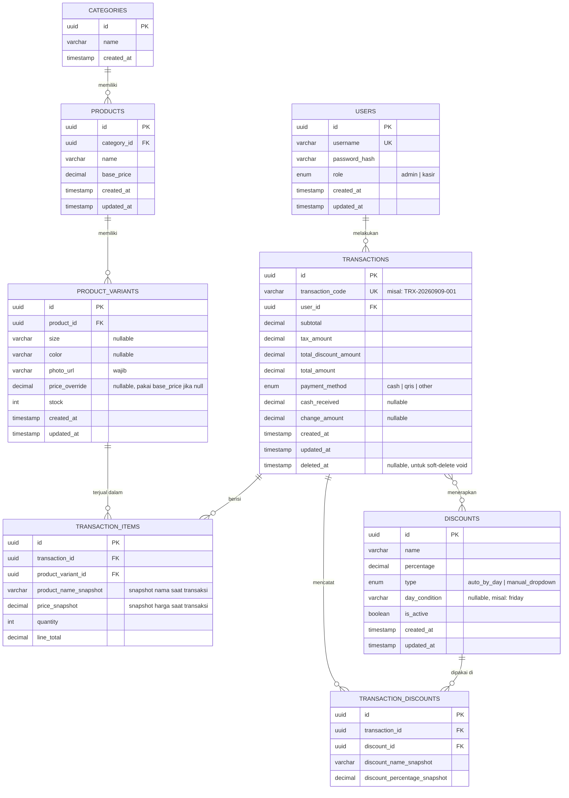

# 09 - ERD (Entity Relationship Diagram)

## 1. Diagram Mermaid

---

## 2. Penjelasan Entitas & Keputusan Desain

### USERS
Menyimpan akun admin & kasir. `role` membedakan hak akses. Password disimpan sebagai `password_hash` (bcrypt/argon2), tidak pernah plaintext.

### CATEGORIES → PRODUCTS (1-to-Many)
Satu kategori (misal "Botol Minum") punya banyak produk induk. Sesuai keputusan: 1 produk hanya masuk 1 kategori.

### PRODUCTS → PRODUCT_VARIANTS (1-to-Many)
Produk induk (misal "Botol Jenis A") punya banyak varian — kombinasi `size` × `color`. Setiap varian:
- Punya **stok independen**
- **Wajib punya foto** (`photo_url`) — sesuai keputusan foto per varian, bukan per produk induk
- `price_override` opsional jika varian tertentu punya harga beda dari `base_price` produk induk

### TRANSACTION_ITEMS — Snapshot Data
Kolom `product_name_snapshot` dan `price_snapshot` **sengaja diduplikasi** dari data produk saat transaksi terjadi. Ini memastikan histori transaksi lama **tidak berubah** meski admin mengedit/menghapus produk di kemudian hari — sesuai keputusan di Tahap 2 & 4.

### DISCOUNTS & TRANSACTION_DISCOUNTS
Satu transaksi bisa punya **lebih dari satu diskon** (stacking: otomatis + manual), jadi relasinya many-to-many lewat tabel penghubung `TRANSACTION_DISCOUNTS`. Kolom snapshot (`discount_name_snapshot`, `discount_percentage_snapshot`) memastikan histori diskon yang dipakai tidak berubah walau admin mengedit diskon tersebut nanti.

### TRANSACTIONS — Soft Delete untuk Void
Kolom `deleted_at` dipakai untuk **soft-delete** saat admin void transaksi (bukan hard-delete), supaya data tetap ada untuk audit meski tidak ditampilkan di riwayat aktif. Saat void terjadi, stok `PRODUCT_VARIANTS` terkait dikembalikan (lihat business logic di `11-API-DESIGN.md`).

---

## 3. Indexing Recommendations

| Tabel | Kolom | Alasan |
|---|---|---|
| `USERS` | `username` (unique index) | Lookup cepat saat login |
| `PRODUCT_VARIANTS` | `product_id` | Query varian per produk induk |
| `TRANSACTIONS` | `created_at` | Filter riwayat transaksi per tanggal (harian/bulanan/custom range) |
| `TRANSACTIONS` | `transaction_code` (unique index) | Lookup transaksi spesifik |
| `TRANSACTION_ITEMS` | `transaction_id` | Query item per transaksi |
| `TRANSACTION_ITEMS` | `product_variant_id` | Untuk laporan produk terlaris (post-MVP) |
