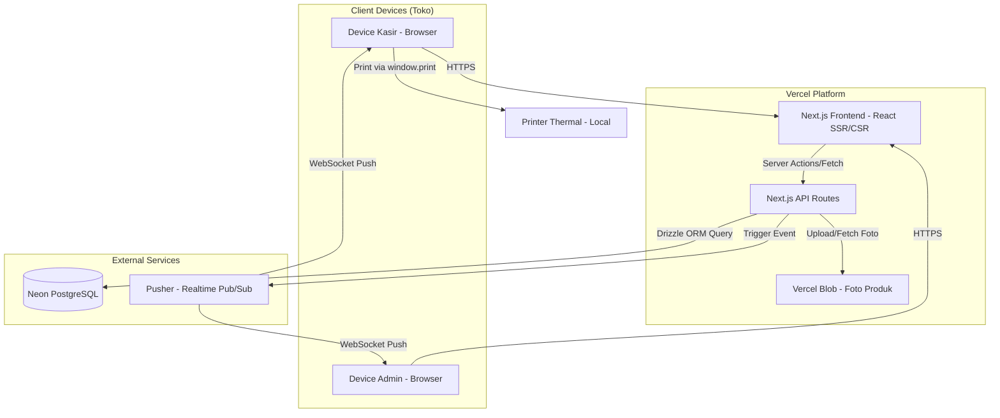
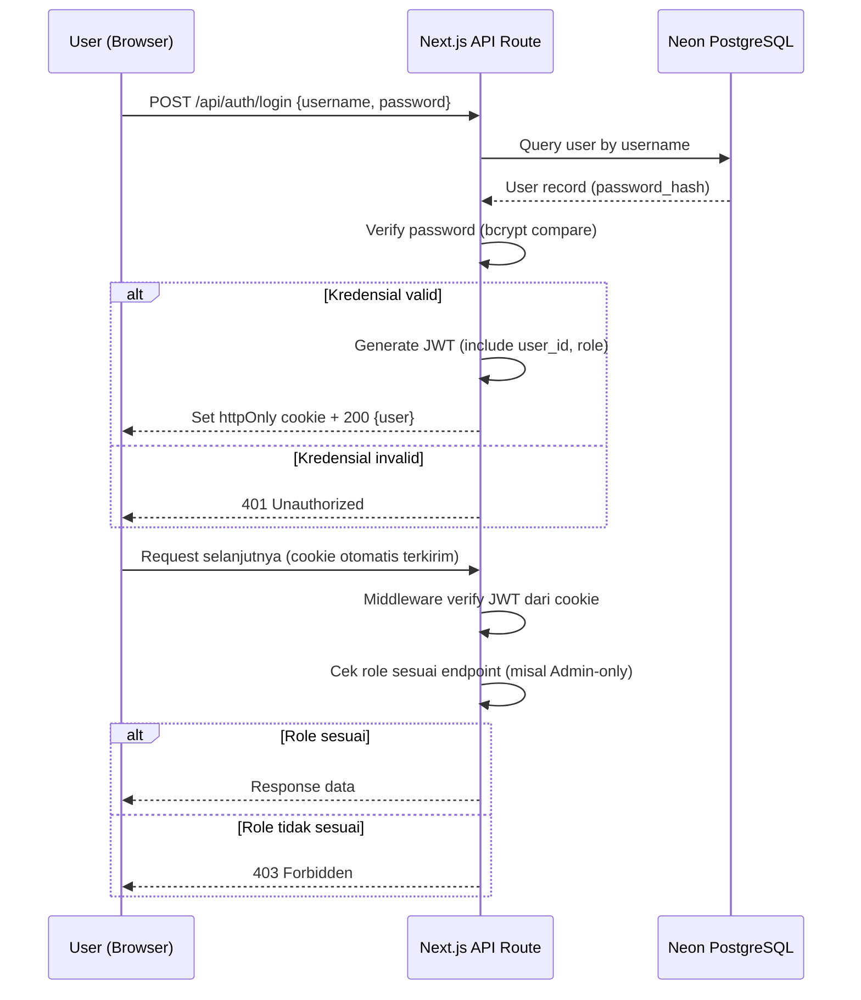
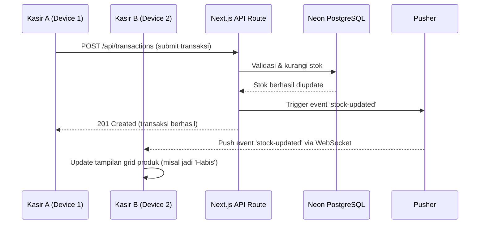

# 12 - System Architecture

## 1. High-Level Architecture Diagram

---

## 2. Komponen Arsitektur

### Frontend (Next.js — React)
- Rendering: kombinasi Server Components (untuk halaman data-heavy seperti riwayat transaksi) dan Client Components (untuk interaktivitas seperti keranjang kasir, real-time update stok).
- State keranjang transaksi disimpan di **local storage browser** (draft, sesuai BR-9) sebelum submit ke server.

### Backend (Next.js API Routes)
- Menjalankan semua business logic: validasi stok, kalkulasi diskon+PPN, snapshot data transaksi, role-based access control.
- Middleware auth memvalidasi JWT dari httpOnly cookie di setiap request yang butuh autentikasi.

### Database (Neon PostgreSQL)
- Diakses lewat Drizzle ORM dari API Routes.
- Koneksi serverless-friendly (Neon dirancang untuk pola koneksi singkat khas serverless function).

### File Storage (Vercel Blob)
- Menyimpan foto produk per varian (wajib upload saat admin menambah varian baru).
- URL foto disimpan di kolom `photo_url` pada tabel `PRODUCT_VARIANTS`.

### Realtime (Pusher)
- Server (API Routes) trigger event ke Pusher setiap kali stok berubah (transaksi submit/void) atau status diskon di-toggle.
- Client (browser kasir & admin) subscribe ke channel `store-updates` untuk menerima update tanpa refresh manual.

---

## 3. Auth Flow

---

## 4. Realtime Stock Sync Flow

---

## 5. Third-Party Services Summary

| Service | Fungsi | Tier |
|---|---|---|
| **Vercel** | Hosting frontend + backend (API Routes) | Free (Hobby) |
| **Neon** | Database PostgreSQL serverless | Free |
| **Pusher** | Realtime pub/sub untuk sync stok & diskon | Free (200k msg/hari) |
| **Vercel Blob** | Storage foto produk per varian | Free tier |

Tidak ada payment gateway diperlukan (QRIS ditampilkan di display kasir fisik terpisah, bukan diproses di web app — sesuai keputusan Tahap 2). Tidak ada service email/SMS/WA (reset password dilakukan manual oleh admin).

---

## 6. Deployment Flow (Ringkas)

1. Kode di push ke repository Git (GitHub/GitLab).
2. Vercel otomatis build & deploy (CI/CD bawaan Vercel — tidak perlu setup pipeline terpisah).
3. Environment variables (Neon connection string, Pusher keys, JWT secret) dikonfigurasi di dashboard Vercel.
4. Database migration dijalankan via Drizzle Kit sebelum/sesudah deploy.

---

## 7. Kesiapan Multi-Tenant (Catatan untuk Masa Depan)

Sesuai keputusan Tahap 4: **versi ini didesain single-tenant** (1 toko = 1 database). Jika nanti Tegukki dikembangkan ke toko lain, pendekatan yang disepakati adalah **1 database terpisah per toko/cabang**, baru diintegrasikan/digabung jika diperlukan oleh pemilik di level lebih tinggi. Arsitektur saat ini tidak memerlukan kolom `tenant_id` di skema database, menyederhanakan development MVP secara signifikan.
